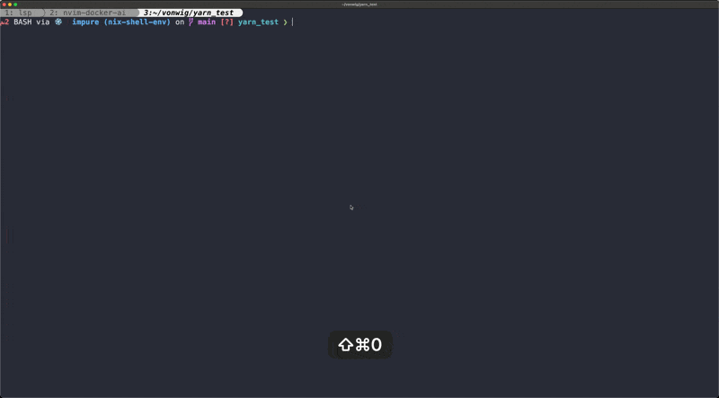

# nvim-copilot

## What is this

This project implements a very simple copilot-like experience in a terminal-based editor (neovim)
using local LLMs.  We are exploring 2 things here.

* can we create copilot-like experiences using only local LLMs?
* how easily can we add llm prompts to a terminal-based editor like neovim?

Here's an example of highlighting some text in a buffer (any buffer), and then using `<leader>ai` to ask the 
LLM a question about this text.


In the next example, we use the command `:GenerateRunbook` to have an LLM generate runnable markdown containing
advice on how to use Docker in the current project.



This plugin also starts an LSP which provides language services for both 
Dockerfiles and Docker compose.yaml files.  Here's an example of the LSP providing completions for a Dockerfile.


## How do you use this

This is distributed as a standard neovim plugin module.  After installing, highlight some text in the buffer 
and type `<leader>ai` to ask the LLM a question about the highlighted text.

## Installation

### Installing with Lazy

If you're using [lazy](https://github.com/folke/lazy.nvim), then add `docker/labs-nvim-copilot` to your setup.

```lua
require('lazy').setup(
  { 
    {
      'docker/labs-nvim-copilot',
      lazy=false,
      dependencies = {
        'Olical/aniseed',
        'nvim-lua/plenary.nvim',
        'hrsh7th/nvim-cmp'
      },
      config = function(plugin, opts)
        require("docker.setup").setup({})
      end,
    },
    {
      'hrsh7th/nvim-cmp',
      dependencies = {'hrsh7th/cmp-buffer',
                      'hrsh7th/cmp-nvim-lsp', }
    },
  }
)
```

### Using Ollama

If you have [Ollama installed](https://ollama.ai/) installed and running, this plugin
will sometimes ask if you want to use it.  Managing the Ollama instance is separate from
the lifecycle of starting and stopping neovim. If you want to use Ollama, you'll have to start it
and ensure that it's listening on port `11434`.

### Using Openai

If you don't have Ollama installed, the plugin will use Openai. However, this requires an API key, which can be set 
in two ways.

1.  Set the `OPENAI_API_KEY` environment variable before you start neovim.
2.  Create a file called `.open-api-key` in your `$HOME` directory and write they key in this file.

### Commands

* **:GenerateRunbook** - generate a runbook markdown file for the current project
* **:DockerDebug** - download internal representations of project context for debug

### Building

```sh
# docker:command=build

make
```

